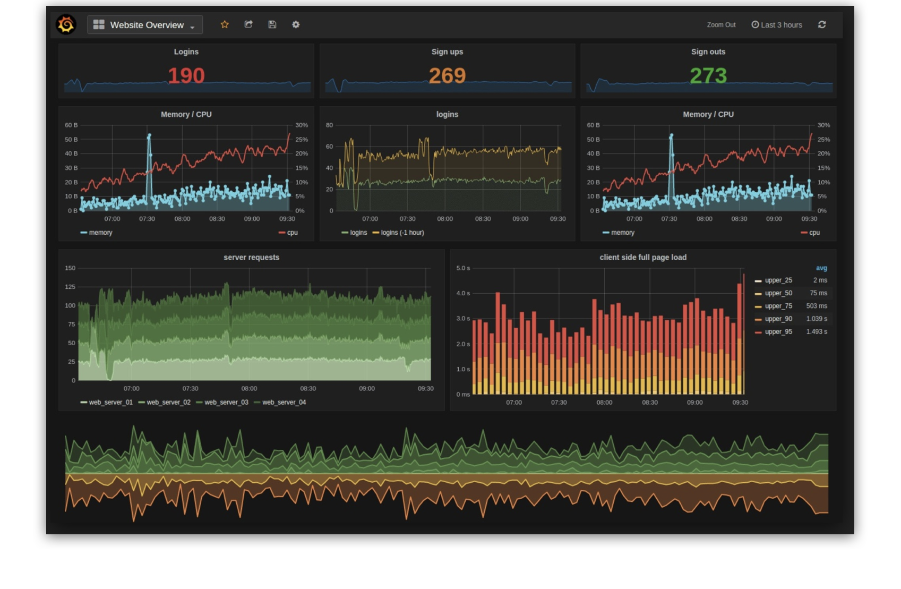

<br /><br />
<p align="center">
  
</p>
<br /><br />

# grafana-cluster
> Scalable Grafana cluster using AWS Fargate.

[](contributing.md)
[](https://www.codefactor.io/repository/github/aws-blocks/grafana-cluster)

Current version: **1.0.0**

Lead Maintainer: [Halim Qarroum](mailto:hqm.post@gmail.com)

## Table of content

 - [Installation](#install)
 - [Features](#features)
 - [Description](#description)
 - [Deployment](#deployment)
 - [Block Parameters](#block-parameters)
 - [Block Outputs](#block-outputs)
 - [See also](#see-also)

## Install

In order to add this block, head to your project directory in your terminal and add it using NPM.

```bash
npm install @aws-blocks/grafana-cluster
```

The stack will be available into the `node_modules/@aws-blocks` directory.

## Features

 - Serverless, scalable deployment of a Grafana cluster on AWS.
 - Load balancer and alerting mechanisms built-in.
 - Provision Grafana properties and plugins from the stack parameters.
 - Non-intrusive and can be seamlessly integrated into your own architecture.

## Description

This repository features a CloudFormation stack which creates a scalable Grafana cluster using Docker containers on AWS Fargate. You can either deploy it as a standalone stack using the AWS console or the AWS CLI, or integrate it as a sub-stack as part of your own deployment.

## Deployment

<br />
<p align="center">
  
  <p align="center"><sub>An screenshot example of a Grafana dashboard.</sub></p>
</p>
<br />

## Block Parameters

Below is a description of the different parameters exposed by this Cloudformation stack. The parameters which do not have a default value must be explicitely specified.

Parameter | Description | Type | Default |
--------- | ----------- | ---- | --------

## Block Outputs

Below is a description of the output variables which are returned by this stack upon a successful deployment. You can use these output variables from a parent stack if you are using this block as a sub-stack.

Output variable | Description
--------------- | -----------

## See also
