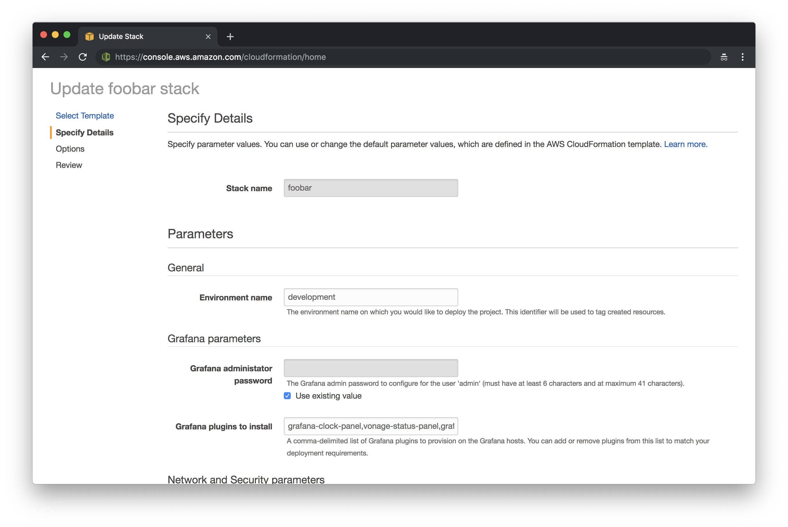

<br /><br />
<p align="center">
  
</p>
<br /><br />

# https-to-mqtts-proxy
> An implementation of an HTTPS-to-MQTTS proxy using API Gateway and AWS IoT.

[](contributing.md)
[](https://www.codefactor.io/repository/github/aws-blocks/https-to-mqtts-proxy)

Current version: **1.0.0**

Lead Maintainer: [Halim Qarroum](mailto:hqm.post@gmail.com)

## Table of content

 - [Installation](#install)
 - [Features](#features)
 - [Description](#description)
 - [Deployment](#deployment)
 - [API](#api)
 - [Testing the proxy](#testing-the-proxy)
 - [See also](#see-also)
 
## Install

If you would like to integrate this stack as a sub-stack into your project, head to your project directory in your terminal and add it using NPM.

```bash
npm install @aws-blocks/https-to-mqtts-proxy
```

The stack will be available into the `node_modules/@aws-blocks` directory.

## Features

 - Serverless proxy encapsulating HTTPS messages on API Gateway to AWS IoT.
 - Secured using IAM roles and optional API keys.
 - Ability to publish messages, update and retrieve shadow documents.
 - Scales up to thousands of messages per second.
 - Non-intrusive and can be seamlessly integrated into your own architecture.

## Description

This repository features a CloudFormation stack which creates a scalable HTTPS proxy between API Gateway and AWS IoT. This comes in handy when wanting to allow legacy devices that do not support the MQTT or MQTT/Websocket protocol to interact with the AWS IoT platform.

This implementation enables write-only messages to be published on given MQTT topics, and also supports shadow updates of HTTPS devices to allowed things in the device registry. It does not involve Lambda functions for proxying messages, and instead relies on a clever direct API-Gateway to AWS IoT integration which supports both JSON messages as well as binary messages.

<br /><br />
<p align="center">
  
</p>
<br /><br />

## Deployment

1. Start by either cloning this repository using the `git` command-line tool or installing it locally using `npm`.

2. Head to the `node_modules/@aws-blocks/grafana-cluster` in your shell and package the stack using the `aws-cli` so that the sub-stacks are bundled with the cloudformation template provided in this repository.

```bash
aws cloudformation package --s3-bucket <an-s3-bucket-you-own> --template-file cloudformation.yml --output-template-file cfn.package.yml
```

3. Once the stack is packaged, you can open the AWS Cloudformation console in your browser and select the **Create Stack** button. Select then the **Upload a template to S3** option and upload the **cfn.package.yml.yml** file that has been created.

4. At this point you can go to your [AWS CloudFormation Console](https://console.aws.amazon.com/cloudformation/home) in your AWS account and deploy the `cfn.package.yml` file.

5. Configure the parameters to match your deployment requirements in the CloudFormation console when deploying your project. More information are available on the parameters made available by this stack in the below section.

<br />
<p align="center">
  
</p>
<br />

6. Once your stack parameters are set click **Next** and **Next** again. On the last page, make sure that you select the **I acknowledge that AWS CloudFormation might create IAM resources.** and the **I acknowledge that AWS CloudFormation might require the following capability: CAPABILITY_AUTO_EXPAND** options before deploying, and once it is selected you can continue with deploying the stack.

## API

Below is a description of the different resources and methods exposed by the HTTPS-to-MQTTS proxy. See the [Testing the proxy](#testing-the-proxy) section for more information on how to easily test these endpoints using `curl`.

Method         | Resource              | Query parameter(s) |  Return code(s)   |  Description
-------------- | --------------------- | ------------------ | ----------------- | -----------------
  **POST**     |  `/message/<topics>`  |      **qos**       |   `200/403/500`   | By calling this endpoint, you need to pass the topics on which you would like to publish (e.g `/message/device/foo`).
  **POST**     | `/shadow/<thingName>` |      **None**      |   `200/403/500`   | This route allows to update the shadow document of a thing, given its `thingName`. The body shall comply with the standard shadow stucture comprising a `state` node and associated `desired` and `reported` nodes. See the [Updating device shadows](#updating-device-shadows) section for an example.

## Testing the proxy

Once the stack is deployed on your account, it will create an *Output* named **ProxyStageUrl** which defines the stage URL associated with your proxy. The following examples only work with `API_KEY` authentication types, since IAM authorization requires a SIGv4 token to be specified as well, make sure the **AuthenticationType** parmameter of your deployment is set to **API_KEY** otherwise the below examples won't work.

### Publishing a message

You can use `curl` to publish a message on different MQTT topics using the HTTPS API. The below example will post a message on the `device/foo` topic.

```bash
curl -XPOST https://<stage-id>.execute-api.<region>.amazonaws.com/development/message/device/foo -H "x-api-key: <api-key>" -H "Content-Type: application/json" -d '{"Hello": "World"}'
```

> Replace the `stage-id`, `region` and `api-key` parameters with your deployment values.

You can chain topic names in the URL and the API accepts up to 7 sub-topics that you can publish on. For instance, the below example publishes a message on the topic `device/foo/bar/baz/qux`.

```bash
curl -XPOST https://<stage-id>.execute-api.<region>.amazonaws.com/development/message/device/foo/bar/baz/qux -H "x-api-key: <api-key>" -H "Content-Type: application/json" -d '{"Hello": "World"}'
```

### Updating device shadows

To update the shadow document associated with a given thing, you can issue a shadow state request using a thing name. See the following example on how to update a thing shadow.

```bash
curl -XPOST https://<stage-id>.execute-api.<region>.amazonaws.com/development/message/device/foo/bar/baz/qux -H "x-api-key: <api-key>" -H "Content-Type: application/json" -d '{"state": "desired": { "Hello": "World" }}'
```

### Sending binary payloads

It is possible to send a binary payload to the proxy API, down to the AWS IoT service. In the following example, we send the content of the `cloudformation.yml` template file associated with this project and which is treated as a binary data to a `device/foo` topic using the `application/octet-stream` content type.

```bash
curl -XPOST https://<stage-id>.execute-api.<region>.amazonaws.com/development/message/device/foo/bar/baz/qux -H "x-api-key: <api-key>" -H "Content-Type: application/octet-stream" --data-binary @cloudformation.yml
```

> Execute this command while in the directory of this project. You can then test sending other type of binary files from your file-system.

### Executing benchmarks

To test the throughput of your API on your development machine you can use Apache Benchmark to tweak the amount of concurrent requests you are issuing and measure the responsiveness of the API. For instance, to execute 500 requests using 10 concurrent connections you can issue the following command.

```bash
ab -n 500 -c 10 -T application/json -m POST -H "x-api-key: <api-key>" https://<stage-id>.execute-api.<region>.amazonaws.com/development/message/device/foo
```

## See also

 - [API Gateway](https://docs.aws.amazon.com/apigateway/latest/developerguide/welcome.html) documentation.
 - [Device Shadow RESTful API](https://docs.aws.amazon.com/iot/latest/developerguide/device-shadow-rest-api.html) documentation.
